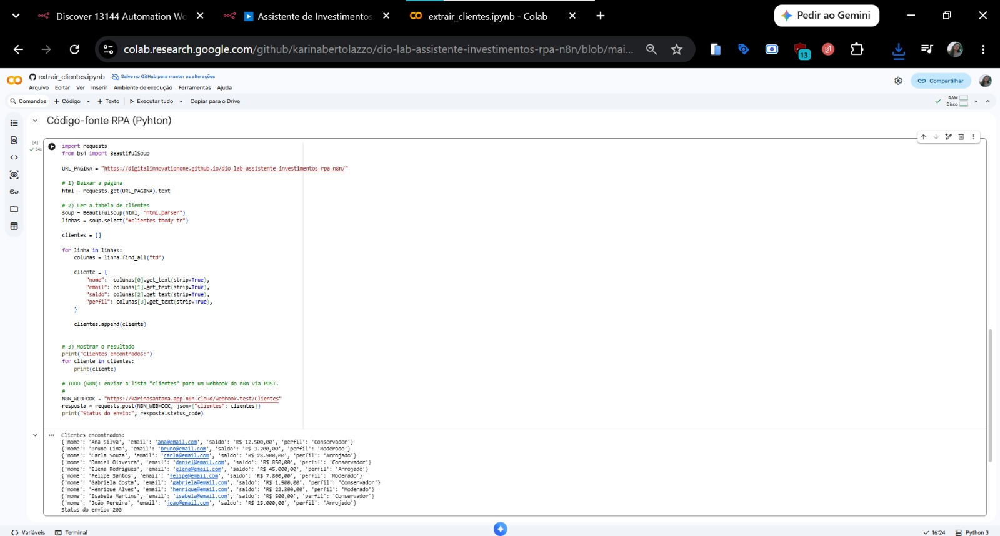
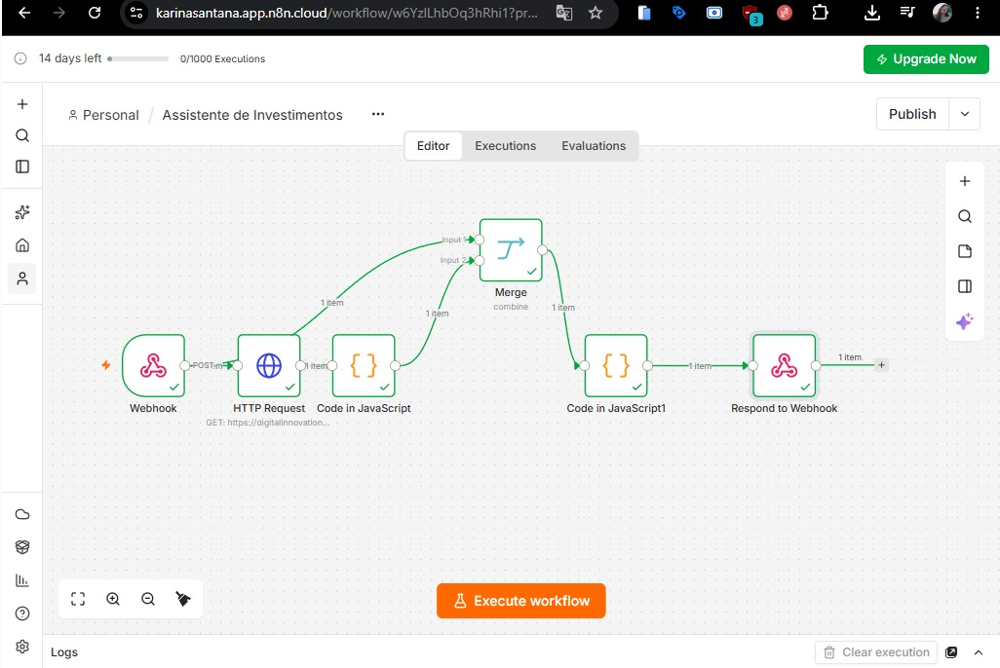
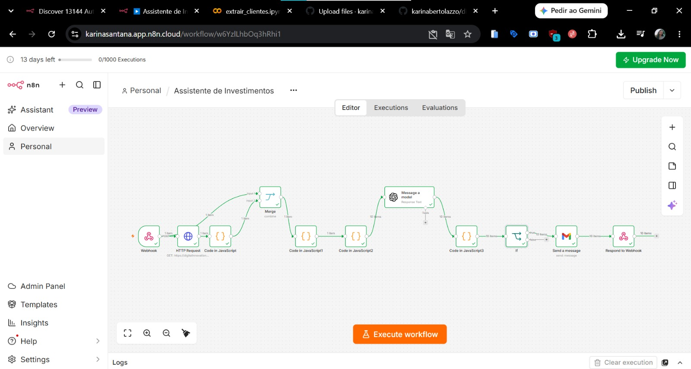
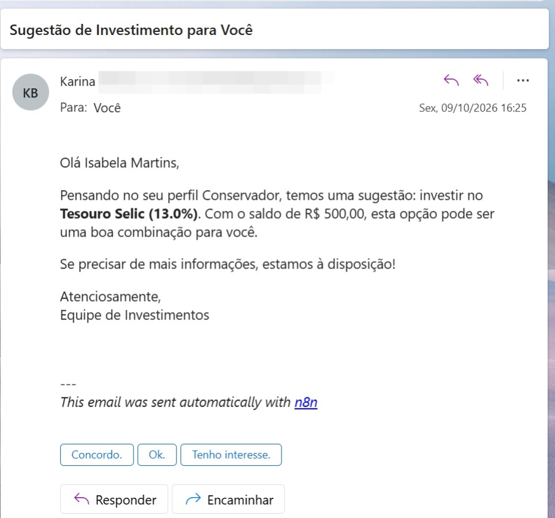

# Documentação Técnica: Assistente de Investimentos

Este documento explica o que foi construído e por que cada decisão foi tomada.

## Visão geral do fluxo
1. **Colab (Python + BeautifulSoup):** extrai nome, e-mail, saldo e perfil dos clientes da página e envia por POST ao Webhook do n8n.
2. **n8n, Webhook:** recebe a lista de clientes.
3. **n8n, HTTP Request + Code:** lê o `data.csv` e transforma o texto em uma lista de investimentos.
4. **n8n, Merge + Code:** junta clientes e investimentos, filtra pelo perfil e pelo saldo mínimo e monta uma mensagem base por perfil (versão MVP, com mensagens estáticas).
5. **n8n, Message a model (GPT-4o):** reescreve a mensagem base como e-mail curto em pt-BR, devolvendo JSON com `subject`, `text_body` e `html_body`.
6. **n8n, Code de normalização:** lê o JSON da IA, garante os campos do e-mail e usa a mensagem base como plano B.
7. **n8n, If + Gmail:** só envia para e-mails em formato válido e manda o e-mail em HTML.

## Decisões técnicas

**RPA com Python em vez de API.** A página de clientes não tem API, então o robô lê a tabela HTML com BeautifulSoup, como uma pessoa faria manualmente.

**Respostas do Webhook.** O Webhook usa o modo "Respond to Webhook", e a resposta é devolvida no final do fluxo.

**Cruzamento por perfil e saldo mínimo.** Cada cliente só recebe produtos do seu perfil (Conservador, Moderado ou Arrojado) cujo valor mínimo cabe no saldo. Entre os possíveis, é escolhido o de maior mínimo.

**Mensagens estáticas como base (MVP).** Cada perfil tem um foco fixo: renda fixa e segurança, mix equilibrado entre renda fixa e variável, ou ações e maior potencial de retorno. Essa mensagem alimenta a IA e também serve de plano B.

**IA com regras no prompt.** A IA recebe perfil, saldo, recomendação e a mensagem base, junto com regras: idioma pt-BR, tom amigável e profissional, texto curto, e evitar promessas de ganho, garantias e linguagem agressiva. Isso é importante porque o conteúdo trata de investimentos.

**Saída em JSON.** Pedir `subject`, `text_body` e `html_body` separados facilita montar o e-mail no Gmail sem tratar texto solto.

**Code de normalização.** A IA pode devolver o JSON dentro de marcações de código ou em formato inesperado, e o e-mail do cliente não vem na resposta dela. O Code limpa o texto, recupera o e-mail do nó anterior e usa a mensagem base quando o JSON falha, para nenhum e-mail sair vazio.

**Validação do e-mail com regex.** O nó If só deixa seguir para o Gmail quem tem endereço em formato válido.

**Destinatário de teste.** Nos testes de envio, os e-mails foram direcionados a um endereço próprio, por meio da constante `EMAIL_TESTE` do último Code. No arquivo exportado ela está vazia, para o fluxo usar o e-mail de cada cliente.

## Limitações
- A URL do Webhook no notebook é uma URL de teste (`webhook-test`) do n8n Cloud, que só responde com o workflow aberto no n8n. O workspace usa o período de teste, por isso o funcionamento foi validado pelos prints.
- Quem importar o `workflow.json` precisa configurar as próprias credenciais de Gmail e de IA, e trocar a URL do Webhook no notebook.
- A IA pode variar o texto a cada execução. Em um dos testes, ela citou a regra "sem garantias" no assunto de um e-mail. O ajuste seria pedir no prompt para não mencionar as regras no texto.

## Demonstração

**RPA (Colab) enviando os clientes ao Webhook, status 200:**

**MVP com mensagens estáticas:**

**Fluxo completo com IA, If e Gmail:**

**E-mail recebido, gerado pela IA:**

